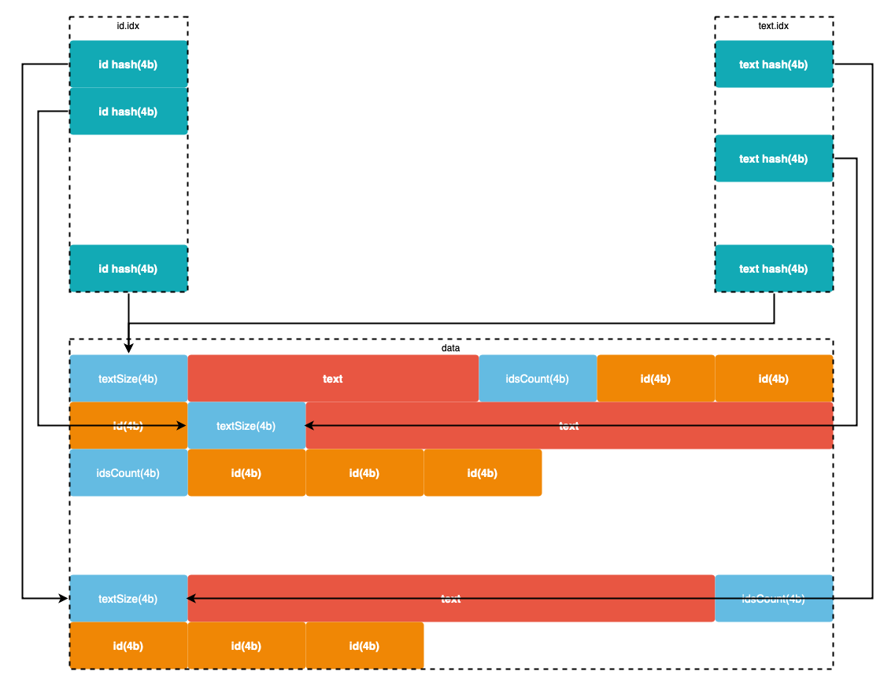

# Alice Database


## Table of contents

* [Generate data file](#generate-data-file)
* [Check unique text hash](#check-unique-text-hash)
* [Database structure](#database-structure)
* [Insert data into database](#insert-data-into-database)
* [Search data in database](#search-data-in-database)

### Generate data file

Generate data.csv file from **Alice's Adventures in Wonderland** book
```bash
time php bin/generate-data.php alice.txt data/data.csv
real    0m6.220s
user    0m4.650s
sys     0m1.123s
```

Generated data.csv file:
* fields: id, text
* total lines 10 000 000
* unique id numbers 10 000 000
* unique text lines 2698
* size 596 MB

### Check unique text hash

Text hash from line to number without collisions [Util::textHash()](./bin/util.php)

Check hash function
```bash
php bin/check-hash.php data/data.csv
duplicate key count percentile 30: 1
duplicate key count percentile 40: 1
duplicate key count percentile 50: 1
duplicate key count percentile 75: 1
duplicate key count percentile 90: 1
duplicate key count percentile 95: 1
duplicate key count percentile 99: 1

total unique keys: 2698
max duplicate key count: 1
max hash number: 866724
```

### Database structure

Id index file:
* max id numbers count 10 000 000 
* number can be stored at 4 bytes
* max index file size ~ 38.1 MB (10 000 000 * 4 / 1024 / 1024)

Text index file:
* max text hash number count 866 724 
* number can be stored at 4 bytes
* max index file size ~ 3.3 MB (866 724 * 4 / 1024 / 1024)

Database file:
* unique text lines 2698 ~ 150 KB
* total id numbers ~ 38.1 MB (10 000 000 * 4 / 1024 / 1024)
* total file size ~ 38.2 MB



### Insert data into database

Insert data
```bash
time php -d memory_limit=4M bin/insert.php data/data.csv
real    2m16.732s
user    0m35.880s
sys     1m37.859s
```

### Search data in database  

Search by id **O(1)**
```bash
time php -d memory_limit=4M bin/search.php id 7742392
telling me next that you never tasted an egg!'

real    0m0.037s
user    0m0.018s
sys     0m0.016s
```

Search by text **O(1)**
```bash
time php -d memory_limit=4M bin/search.php text "telling me next that you never tasted an egg\!'" | grep 7742392
7742392

real    0m0.042s
user    0m0.024s
sys     0m0.021s
```
